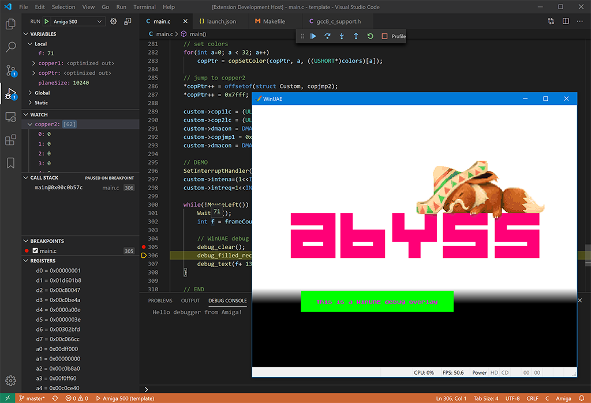
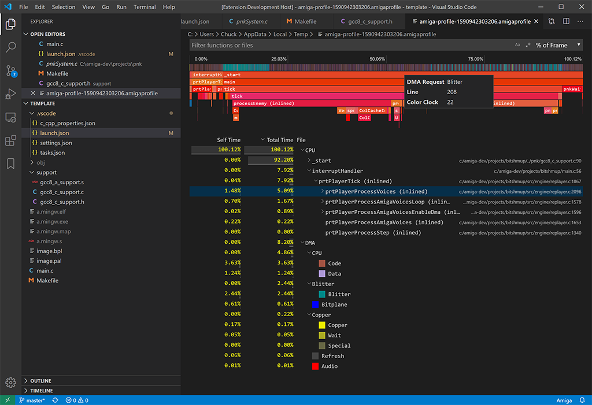

# _amiga-debug_ Visual Studio Code Extension (Windows only)

**One-stop Visual Studio Code Extention to compile, debug and profile Amiga C/C++ programs compiled by the bundled gcc 11.2 with the bundled WinUAE.**

## Overview
This fully self-contained extension will help you to quickly develop demos, intros, games, etc. for the Amiga 500, 1200, 4000. It supports C and C++, however no standard library is available. It comes with advanced productivity features like debug overlay, frame profiler, graphics debugger and size profiler.





## Video
Here's a video showing off all the new features of v1.1, including the frame profiler and graphics debugger: https://www.youtube.com/watch?v=gQ4tKisnr7Y

## Quick-start
0. Install the extension from the Visual Studio Code Marketplace
1. Create a new empty project folder with `File > Open Folder...`
2. From the command palette <kbd>Ctrl+Shift+P</kbd> select `Amiga: Init Project`
3. Open `.vscode/launch.json` and point `"kickstart"` to your *Kickstart 1.3* ROM
3. Hit <kbd>F5</kbd> to build and run a minimal sample project
4. If you prefer C++ instead of C, just rename `main.c` to `main.cpp`

## Features
- No additional tools required. Everything is included (except Kickstart ROM 😒). Ready to go make your next Amiga 500 production!
- State-of-the-art code generation by GCC with Link-Time-Optimizations (LTO) for increased performance and smaller code size
- IntelliSense for C, C++, and assembly
- Full source-level and assembly-level debugging with callstack, breakpoints, data breakpoints (watchpoints), watches, registers, memory view with GDB-enabled WinUAE
- Fully AmigaOS compatible via included .h files
- `INCBIN`, `INCBIN_CHIP` support
- Output to debug console from WinUAE
- WinUAE warp-launch (turbo-boot)
- WinUAE warp-mode control from your Amiga project (speed up precalc during development)
- WinUAE debug overlay, full control from your Amiga project
- Frame Profiler: function-level + DMA cycles profiling (A500, A1200 (PAL) only)
- Graphics Debugger: replay a captured frame cycle by cycle and watch your bitmaps change in real-time; Visualize all blitter operations, bitmap writes, copper list, custom registers
- Size Profiler: profile the size of your executable by functions, data and references
- Shrinkler executable cruncher with size profiling: profile the size of your compressed executable (right-click Amiga EXE files in the explorer)
- Disassembly: Show disassembly of ELF file incl. 68000 cycle count and correlation with source code (right-click Amiga ELF files in the explorer)
- Terminal window with access to the build tools
- Extension automatically mounts executable's directory as `dh1:`, allowing for reading and writing files.

## How-to-use
- `Amiga: View Memory`, `Amiga: Set Force Disassembly`, `Amiga: View Disassembly (Function)` are available from the command palette <kbd>Ctrl+Shift+P</kbd>
- Use the command `Amiga: Open Terminal` to open a shell with the environment set to use the included tools like `elf2hunk`, `gcc`, `gnumake` etc. (e.g. `gnumake clean`)
- Frame Profiler: function-level + DMA profiling: during a debugging session, press the `Profile` button on the right of the debug toolbar, and 1 frame will be profiled. Press the rightmost button to profile 50 frames. Mark your WaitVBLs etc with calls to `debug_start_idle()` and `debug_stop_idle()` to show correct CPU usage under thumbnails.
- Size Profiler: profile the size of your executable: right-click an ELF file in the Explorer, and select `Amiga: Profile File Size`
- WinUAE debug overlay: see debug_* calls in template project's main.c
- WinUAE:
  - <kbd>^</kbd> = single step, <kbd>Pause</kbd> = pause/resume <kbd>Page-up</kbd> = warp mode
  - all necessary options are already configured for Amiga 500, Kickstart 1.3 (for debugging), if you want to change some things (resolution, window size, etc.) just go into the `Configurations` tab, select `default`, and hit `Save`

## Supported Amiga Models

- Possible values of `"config"` in `.vscode/launch.json`:
  - `"A500"`: KS 1.3, ECS Agnus, 0.5MB Chip + 0.5MB Slow; needs Kickstart 1.3 ROM in `"kickstart"`
  - `"A1200"`: 68020, 2MB Chip; needs Kickstart 3.1 ROM in `"kickstart"`
  - `"A1200-FAST"`: A1200 with 4MB fast memory
  - `"A1200-030"`: A1200 with Blizzard 1230-IV and 32MB board memory. Requires the absolute path to the Blizzard ROM in `"cpuboard"`.
  - `"A3000"`: A3000 (no profiler support); needs Kickstart 2.0 ROM in `"kickstart"`
  - `"A4000"`: 68030, 68882, 2MB Chip, 8MB FAST; needs Kickstart 3.1 ROM in `"kickstart"`
- Also, you can override the memory configuration using following fields (values are case-insensitive):
  - `"chipmem"` - allowed values: "256k", "512k", "1m", "1.5m" or "2m"
  - `"fastmem"` - allowed values: "0", "64k", "128k", "256k", "512k", "1m", "2m", "4m", "8m"
  - `"slowmem"` - allowed values: "0", "512k", "1m", "1.8m"

## Credits
- Code by [Bartman/Abyss](https://github.com/BartmanAbyss)
- Testing by [Pink/Abyss](https://soundcloud.com/pink_abyss)

## Already used in these productions
- [Coda](http://www.pouet.net/prod.php?which=80998) by Abyss
- [Tiny Invaders](http://www.pouet.net/prod.php?which=85458) by Abyss
- [Tiny Galaga](http://www.pouet.net/prod.php?which=85720) by Abyss
- [Tiny Bobble](http://eab.abime.net/showthread.php?t=103546) by Abyss
- [AmigaKlang](http://www.pouet.net/prod.php?which=85351) by Alcatraz & Haujobb

## Acknowledgements
Debugger support is based in part on Marcel Ball's [Cortex-Debug](https://github.com/Marus/cortex-debug) extension.

Copper Disassembly and hardware register documentation is based in part on prb28's [vscode-amiga-assembly](https://github.com/prb28/vscode-amiga-assembly) extension.

Some modifications of GCC are based on work by [Stefan "Bebbo" Franke](https://github.com/bebbo).

Profiler visualizer is based in part on Microsoft's [vscode-js-profile-visualizer](https://github.com/microsoft/vscode-js-profile-visualizer) extension.

Amiga system-includes (NDK 3.9) copied from an installation of Bebbo's [amiga-gcc](https://github.com/bebbo/amiga-gcc/blob/master/Makefile) and modified to work with GCC 8+. Originally downloaded from http://www.haage-partner.de/download/AmigaOS/NDK39.lha

Commodore Amiga Icon by [Icons8](https://iconscout.com/contributors/icons8).

[The Player® 6.1A](https://www.pouet.net/prod.php?which=19922): Copyright © 1992-95 Jarno Paananen.

P61.testmod - Module by Skylord/Sector 7

[depack_doynax.s](https://csdb.dk/release/?id=118678) - Lempel-Ziv decompressor by Johan "Doynax" Forslöf.

[KingCon V1.2](http://aminet.net/package/dev/cross/WinUAEDemoToolchain5) - Command Line Image to Big Endian Raw Converter Written by Soren Hannibal/Lemon.

This extension contains binaries of:
- modified [GCC 11.2.0](ftp://ftp.fu-berlin.de/unix/languages/gcc/releases/gcc-11.2.0/) (patch included)
  - Copyright (C) 2021 Free Software Foundation, Inc.
  - This is free software; see the source for copying conditions.  There is NO warranty; not even for MERCHANTABILITY or FITNESS FOR A PARTICULAR PURPOSE.
- modified [GNU gdb (GDB) 12.0.50.20211014-git](https://github.com/BartmanAbyss/binutils-gdb)
  - Copyright (C) 2021 Free Software Foundation, Inc.
  - License GPLv3+: GNU GPL version 3 or later <http://gnu.org/licenses/gpl.html>
- modified [WinUAE 4.9.0](https://github.com/BartmanAbyss/WinUAE)
- modified [Shrinkler 4.6](https://github.com/BartmanAbyss/Shrinkler)
  - Copyright 1999-2015 Aske Simon Christensen
  - Modified 2020, Bartman/Abyss
- modified elf2hunk (source included)
  - Copyright (c) 1995-2017, The AROS Development Team. All rights reserved.
  - Modified 2018-2020, Bartman/Abyss
- GNU Make 4.2.1
  - Copyright (C) 1988-2016 Free Software Foundation, Inc.
  - License GPLv3+: GNU GPL version 3 or later <http://gnu.org/licenses/gpl.html>
  - This is free software: you are free to change and redistribute it. There is NO WARRANTY, to the extent permitted by law.
- `cd`, `EndCLI`, `run` from Workbench 1.3

## Caveats
- sometimes when you're multiplying 2 WORDs together, `gcc` tries to use a (slow) 32-bit multiply. So if you have performance-critical multiplications, consider using the `muluw` and `mulsw` functions from `gcc8_c_support.h`

## Contributing
For development, just install the latest [node.js](https://nodejs.org/en/), create a new directory, clone the repository `git clone https://github.com/BartmanAbyss/vscode-amiga-debug.git`, then install the dependencies with `npm install`. To build, open the directory in VS Code and hit `F5`. You can then test the extension without building a `.vsix`.
To build a `.vsix`, `npm install -g vsce` (once), and then `vsce package`.

## Porting
Currently this extension only works on Windows due to the included Windows-only binaries of gcc, gdb, elf2hunk and WinUAE.
Compilation of gcc, gdb and elf2hunk on Linux should be trivial, as gcc and gdb only contain about 10 lines of code modifications. elf2hunk should work on Linux out-of-the-box. However, porting the GDB-server contained in WinUAE to FS-UAE could be a bit more work. 99% of WinUAE changes are contained in `od-win32/barto_gdbserver.cpp|h`.

Here are the command-lines used to compile the external tools (We're building with MinGW on WSL to `c:\amiga-mingw\opt`)

### Ubuntu 20.4 LTS from Microsoft Store
```powershell
Enable-WindowsOptionalFeature -Online -FeatureName Microsoft-Windows-Subsystem-Linux
Enable-WindowsOptionalFeature -Online -FeatureName VirtualMachinePlatform
```

### MinGW on WSL2 (Ubuntu 20.04)
```bash
sudo apt install build-essential flex bison expect dejagnu texinfo mingw-w64
```

### Binutils+GDB
```bash
cd binutils-gdb
./contrib/download_prerequisites
cd ..
mkdir build-binutils-gdb
cd build-binutils-gdb
LDFLAGS="-static -static-libgcc -static-libstdc++" ../binutils-gdb/configure --prefix=/mnt/c/amiga-mingw/opt --target=m68k-amiga-elf --disable-werror -enable-static --disable-shared --disable-interprocess-agent --disable-libcc --host=x86_64-w64-mingw32
make -j6
make install
```

### GCC
```bash
wget https://ftp.gwdg.de/pub/misc/gcc/releases/gcc-11.2.0/gcc-11.2.0.tar.xz
tar -xf gcc-11.2.0.tar.xz
cd gcc-11.2.0
patch -p1 < ../gcc-barto.patch
./contrib/download_prerequisites
cd ..
mkdir -p build-gcc-11.2.0
cd build-gcc-11.2.0
LDFLAGS="-static -static-libgcc -static-libstdc++" ../gcc-11.2.0/configure \
  --target=m68k-amiga-elf \
  --disable-nls \
  --enable-languages=c,c++ \
  --enable-lto \
  --prefix=/mnt/c/amiga-mingw/opt \
  --disable-libssp \
  --disable-gcov \
  --disable-multilib \
  --disable-threads \
  --with-cpu=68000 \
  --disable-libsanitizer \
  --disable-libada \
  --disable-libgomp \
  --disable-libvtv \
  --disable-nls \
  --disable-clocale \
  --host=x86_64-w64-mingw32 \
  --enable-static
make all-gcc -j6
sed 's/selftest # srcextra/# selftest srcextra/' gcc/Makefile >gcc/Makefile.tmp
mv gcc/Makefile.tmp gcc/Makefile
gcc/gcc-cross.exe -dumpspecs >gcc/specs
make all-gcc -j6
make install-gcc
```

### elf2hunk
https://github.com/BartmanAbyss/elf2hunk

### Cleaning up unnecessary files and stripping EXE files of debug information to reduce size
```bash
rm -r /mnt/c/amiga-mingw/opt/include
rm -r /mnt/c/amiga-mingw/opt/share
find /mnt/c/amiga-mingw/opt -name *.exe | xargs strip
```

## Known Issues/TODOs

### Documentation
* TODO: better documentation

### Profiler
* lines of functions seem to be off (see template/main.c: function main)
* TODO: show blitter priority in profiler
* TODO: drag across flame-graph to measure durations
* TODO: multi-frame profiling: allow user to select number of frames
* TODO: code lenses: update when display unit changes, when frame changes
* "npm run serve": all colors in flame-graph are black

### Savestate Debugger
* TODO: kill winuae/gdb when quitting vscode
* (internal) status of tested savestates: `c:\amiga_state`
  - `desertdream-dots.uss`: ok
  - `gods.uss`: palette missing, maybe WinUAE issue?

### Assembly
* TODO: parser needs to check for comments
* TODO: show 68000 cycles
* TODO: more...

### Objdump
* TODO: click/follow any addresses

### Terminal
* Terminal doesn't open again once closed

### WinUAE
* execution for A4000 model is very flaky (since 1.2.1)
* TODO: fill memory with $DEAD on startup to better find uninitialized memory bugs
* TODO: debugger: detect more exceptions in a better way (not just setting a single breakpoint at every exception vector)

### Debugger
* disassembly chokes a bit on newlines
* data breakpoints read/read-write (there doesn't seem to be an UI for this in VSCode)
* store assembly breakpoints in one "virtual" file in breakpointMap (how?!)
* vscode.debug.activeDebugSession is undefined when program is stopped on entry
* not getting handleThreadSelected(), thread ID now set in class
* sometimes Pause/Resume button doesn't correctly switch to "Pause" icon while amiga program is running
* step out of kickstart: set fake breakpoint at 0xfffffff, WinUAE should enter TRACE_RANGE_PC mode (TODO: tighten range around loaded program), but keeps breaking later
* memory, disassembly: use VSCode built-in requests <= not implemented in VSCode, only in DebugAdapter specification
* in disassembly view, skipping subroutines with `Step Over` may not work in inlined functions (limitation of GDB)

### Gfx Debugger
* TODO: show source blitter-rects
* TODO: show 2 resources
* TODO: tooltips for blitter-rects?
* Multi-frame: Resource from Copper: memory not ok?

